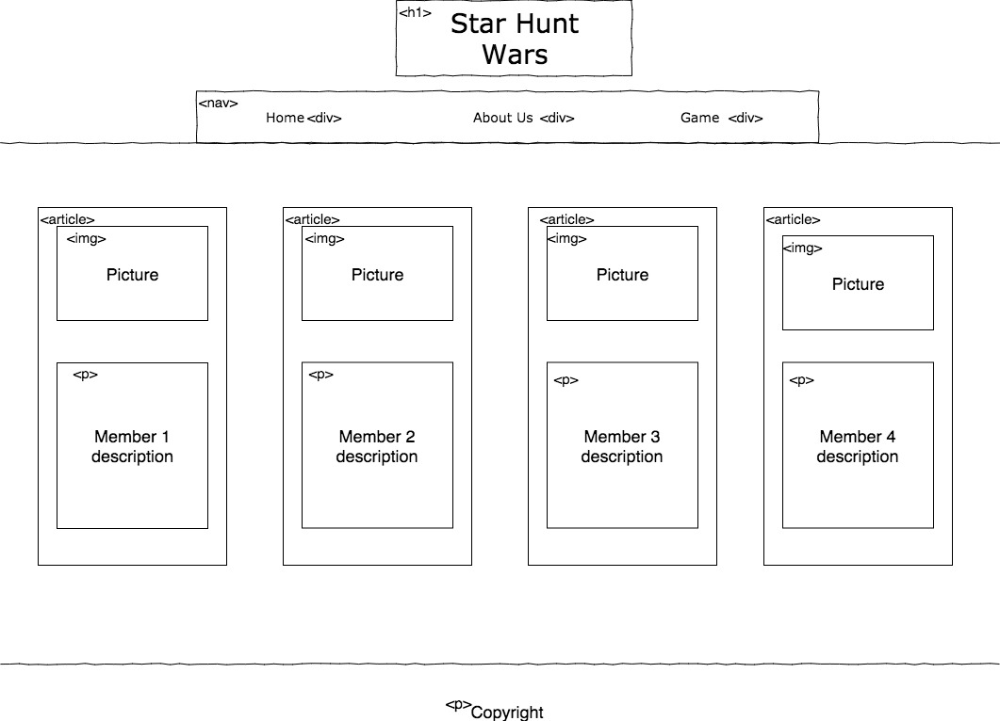
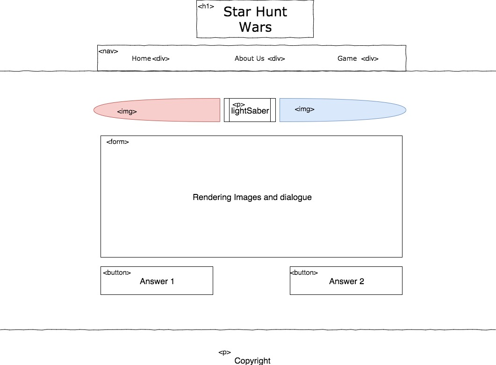
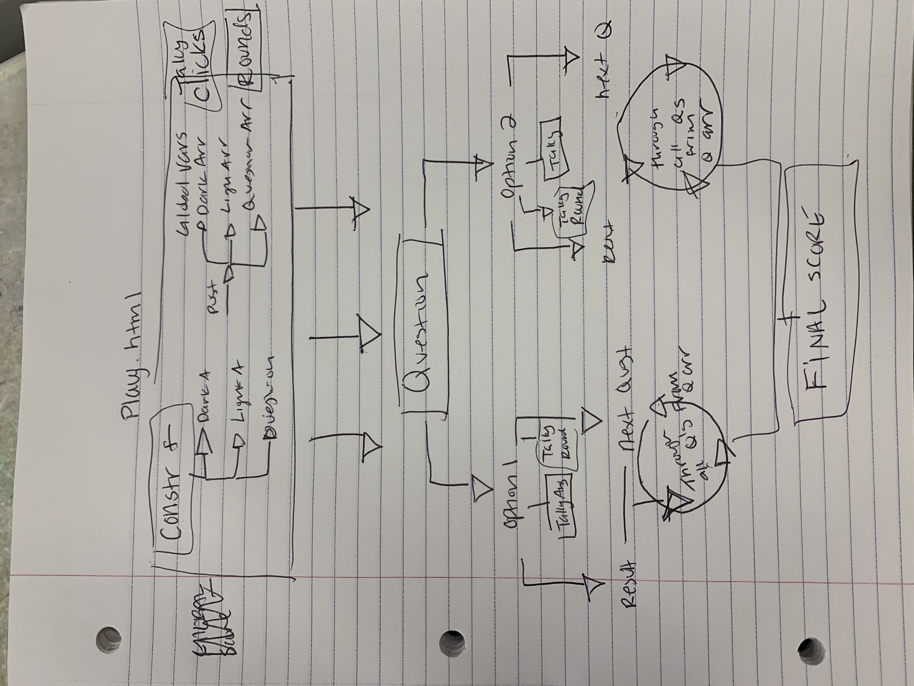

# Star-Hunt-Wars
Project consist on star wars trilogy theme and specifically the Mandalorian bounty hunter 

# Team Members  
Jin Woo Kim  
Enoch Strok  
Beth Hansen  
Cait Rowland  

# User Stories

- As a user I would like a game, so that I am entertained 
- As a user, I would like this game to be Star Wars themed, so that I can be involved in the Star Wars world
- As a user, I would like to input my name so that the game is more personalize to me 
- As a user, I would like to see an about the team, so that I know who built the game
- As a user, I would like to know the rules of the game beforehand, so that I know how to play
- As a user, I would like to be presented with a series of situational questions so that I can find out if I lean more to the dark side or the light side 
- As a user, I would like an intro to the game, so that I know what the storyline will be for the questions
- As a user, I would like my answers to be tallied throughout the game so that I know which way I am leaning
- As a user, I would like to be presented with the results of each answer, so that I know how my choices affect my overall standing 
- As a user, I would like to see my final result so that I know if my answers were more dark or more light 

- As a user, I want to know how to navigate the website, so that I know where I am at all time.
- As a User , I don't want story to be predictable, so that I don't know whats going on.

# Wire-Frame
## index.html

## about-us.html

## play.html

# Domain Model

#Resources 
Moving star background: 
https://zcode.io/tutorials/creation-lightsaber-css-animation

Lightsaber code was derived from: 
https://codepen.io/GeoffreyCrofte/pen/jGgIo

Test line 